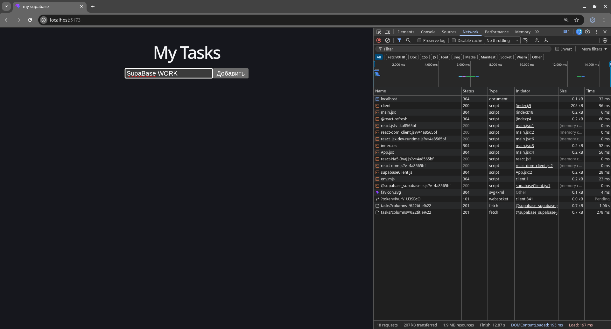
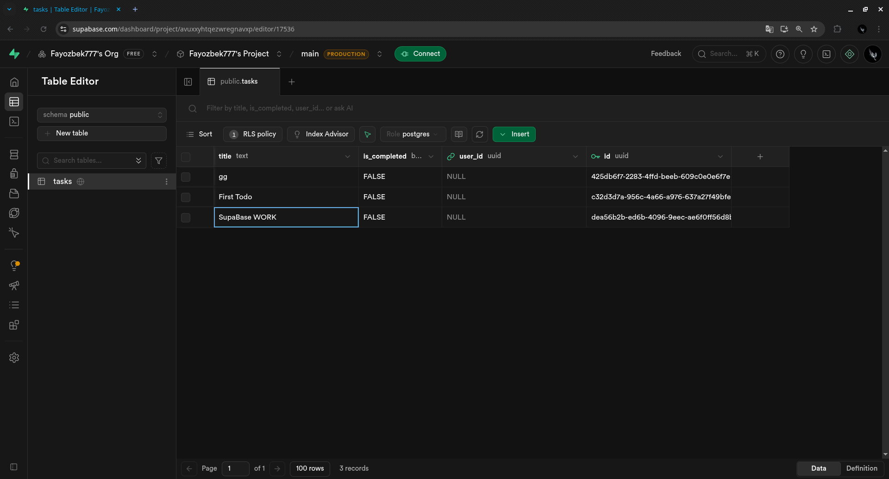

# 🚀 React + Supabase Todo App





Простое и мощное Fullstack-приложение для управления задачами. Построено на современном стеке с использованием облачной базы данных.

## 🛠 Стек технологий
- **Frontend:** React 18, Vite
- **Backend-as-a-Service:** [Supabase](https://supabase.com) (PostgreSQL + RLS)
- **Deployment:** Vercel
- **State Management:** React Hooks (useState, useEffect)

## ⚡️ Особенности
- **Real-time Database:** Мгновенное сохранение задач.
- **Row Level Security (RLS):** Защита данных на уровне базы.
- **Environment Variables:** Безопасное хранение ключей API.


## 🚀 Как запустить локально

1. **Клонируйте репозиторий:**
   ```bash
   git clone https://github.com
   cd supabase


Установите зависимости:
bash
npm install


Настройте переменные окружения:
Создайте файл .env в корне проекта и добавьте свои ключи из Supabase:
env
VITE_SUPABASE_URL=your_project_url
VITE_SUPABASE_ANON_KEY=your_anon_key


Запустите проект:
bash
npm run dev


🏗 Структура базы данных (Supabase)
Таблица tasks:
id: int8 (Primary Key)
created_at: timestamptz
title: text (Название задачи)
is_completed: bool (Статус)
user_id: uuid (Связь с auth.users)
📝 Лицензия
MIT

---

### Что сделать теперь в терминале:

1.  **Сохрани файл** `README.md`.
2.  **Добавь изменения и отправь их на GitHub:**
    ```bash
    git add README.md
    git commit -m "docs: update readme with project info"
    git push
    ```

### Финальный штрих для Vercel:
Когда ты зайдешь в панель управления [Vercel](https://vercel.com), нажми **Add New -> Project**, выбери этот репозиторий и **ОБЯЗАТЕЛЬНО** в разделе **Environment Variables** добавь:
*   `VITE_SUPABASE_URL`
*   `VITE_SUPABASE_ANON_KEY`
